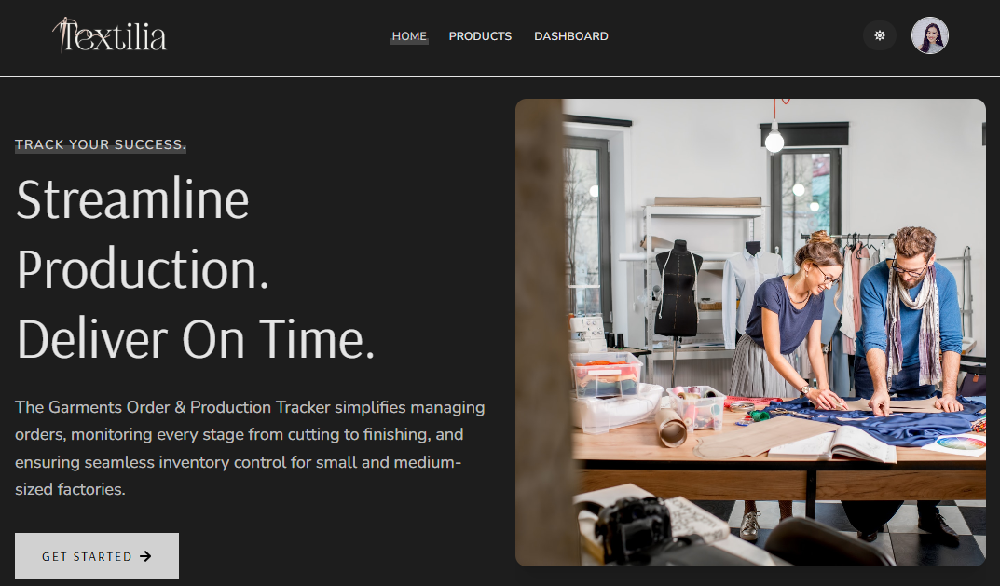

# Textila – Garments Order & Production Tracker System

## Project Overview

**Textila** is a full-stack web application designed to help small and medium-sized garment factories manage orders, production workflow, inventory, and delivery tracking efficiently.  
The system supports **role-based dashboards** for **Admin, Manager, and Buyer**, with secure authentication and real-time order tracking.

This project was built as part of an **assignment to demonstrate full-stack development skills**, including frontend UI/UX, backend APIs, authentication, payment handling, and deployment readiness.

---

## Live Website

**Live URL:** https://textila-garments.web.app/

---

## Admin & Test Credentials

### Manager

- **Email:** romana2@email.com
- **Password:** Romana2

### Buyer

- **Email:** romana3@email.com
- **Password:** Romana3

---

## Screenshot



## Key Features

### Authentication & Security

- Firebase Authentication (Email & Password)
- Google / GitHub Login (optional)
- JWT-based route protection
- Secure environment variables for Firebase & MongoDB
- Role-based access control (Admin / Manager / Buyer)

---

### Public Pages

- Modern Home Page with Framer Motion animations
- Products from MongoDB (limited & full list)
- Product Details Page
- Responsive Navbar & Footer
- 404 Not Found Page

---

### Buyer Features

- View all products
- Place orders with quantity validation (MOQ & stock limit)
- **Payment Options**
  - Cash on Delivery
  - PayFast (Stripe Checkout)
- View My Orders
- Cancel Pending Orders
- Track Order Progress (Timeline View)
- View Payment History
- Profile Page with Suspend Feedback (if applicable)

---

### Manager Dashboard

- Add Product
- Manage Own Products
- View Pending Orders
- Approve / Reject Orders
- Add Production Tracking Updates
  - Cutting
  - Sewing
  - Finishing
  - QC Checked
  - Packed
  - Shipped
- View Approved Orders
- Profile Page

---

### Admin Dashboard

- Manage Users (Approve / Suspend with reason)
- Change User Roles (Buyer / Manager)
- View All Products
- Control Home Page Products
- View All Orders
- Filter Orders by Status
- Analytics Dashboard (Optional Bonus)

---

## Payment System

- Stripe Checkout Integration (PayFast)
- Dynamic quantity & price calculation
- Order is saved **only after successful payment**
- Secure payment confirmation via backend
- COD orders skip payment flow

---

## Additional Functionalities

- Loading spinner during API calls
- Toast & SweetAlert notifications
- Search & filter (Users / Products / Orders)
- Pagination implemented
- Fully responsive design (Mobile / Tablet / Desktop)
- Dark / Light Theme Toggle
- Dynamic Page Titles

---

## Technologies Used

### Frontend

- React.js
- React Router
- Tailwind CSS
- DaisyUI
- TanStack React Query
- React Hook Form
- Framer Motion
- SweetAlert2

### Backend

- Node.js
- Express.js
- MongoDB
- Stripe API
- JWT Authentication

### Authentication

- Firebase Authentication

### Deployment

- Client: Firebase
- Server: Vercel

---

## NPM Packages Used

### Client Side

- react-router
- @tanstack/react-query
- react-hook-form
- framer-motion
- sweetalert2
- axios

### Server Side

- express
- cors
- mongodb
- jsonwebtoken
- stripe
- dotenv

---

## ⚙️ How to Run the Project Locally

Follow the steps below to run the **Textila** project on your local machine.

---

### Prerequisites
Make sure you have the following installed on your system:

- Node.js (v18 or later recommended)
- npm or yarn
- MongoDB (local or MongoDB Atlas)
- Git

---

### Step 1: Clone the Repositories

```bash
git clone https://github.com/romanakhatun/textilia-garments-client.git
git clone https://github.com/romanakhatun/textilia-garments-server.git
```
### Step 2: Install Dependencies

#### Client Side

```bash
cd textila-client
npm install
```
#### Server Side

```bash
cd textila-server
npm install
```
### Step 3: Environment Variables Setup

Create a `.env` file in both client and server directories.

#### Client `.env`

```bash
VITE_apiKey=your_firebase_api_key
VITE_authDomain=your_firebase_auth_domain
VITE_projectId=your_firebase_project_id
VITE_storageBucket=your_firebase_storage_bucket
VITE_messagingSenderId=your_firebase_messaging_sender_id
VITE_appId=your_firebase_app_id
```

#### Server `.env`

```bash
PORT=5000
DB_USER=your_mongodb_user
DB_PASS=your_mongodb_password
FB_SERVICE_KEY=your_jwt_secret
STRIPE_SECRET=your_stripe_secret_key
SITE_DOMAIN=http://localhost:5173
```

### Step 4: Run the Project

#### Start the Backend Server

```bash
cd textila-server
npm run dev
```

#### Start the Frontend Client

```bash
cd textila-client
npm run dev
```
### Step 5: Open in Browser

```bash
Open your browser and visit:
http://localhost:5173
```
